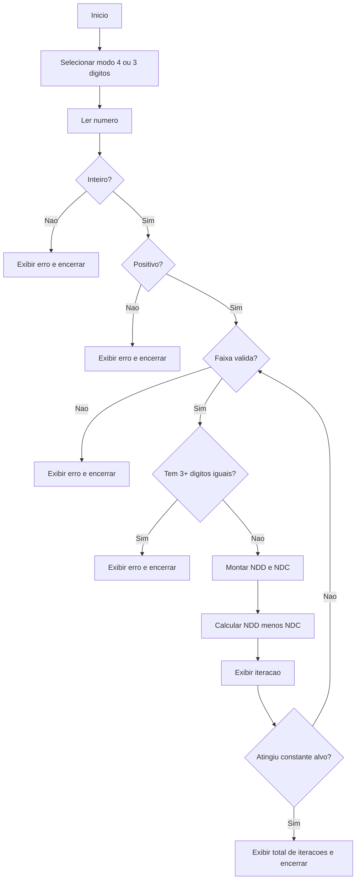

# Diagrama de fluxo da rotina

```mermaid
flowchart TD
start[Inicio] --> selecionarModo[Selecionar modo 4 ou 3 digitos]
selecionarModo --> lerNumero[Ler numero]
lerNumero --> validarTipo{Inteiro?}
validarTipo -->|Nao| erroTipo[Exibir erro e encerrar]
validarTipo -->|Sim| validarPositivo{Positivo?}
validarPositivo -->|Nao| erroSinal[Exibir erro e encerrar]
validarPositivo -->|Sim| validarFaixa{Faixa valida?}
validarFaixa -->|Nao| erroFaixa[Exibir erro e encerrar]
validarFaixa -->|Sim| validarRep{Tem 3+ digitos iguais?}
validarRep -->|Sim| erroRep[Exibir erro e encerrar]
validarRep -->|Nao| montarNddNdc[Montar NDD e NDC]
montarNddNdc --> subtrair[Calcular NDD menos NDC]
subtrair --> exibirPasso[Exibir iteracao]
exibirPasso --> atingiuConst{Atingiu constante alvo?}
atingiuConst -->|Nao| validarFaixa
atingiuConst -->|Sim| fim[Exibir total de iteracoes e encerrar]
```
